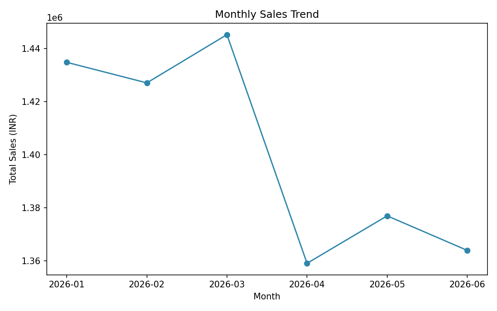
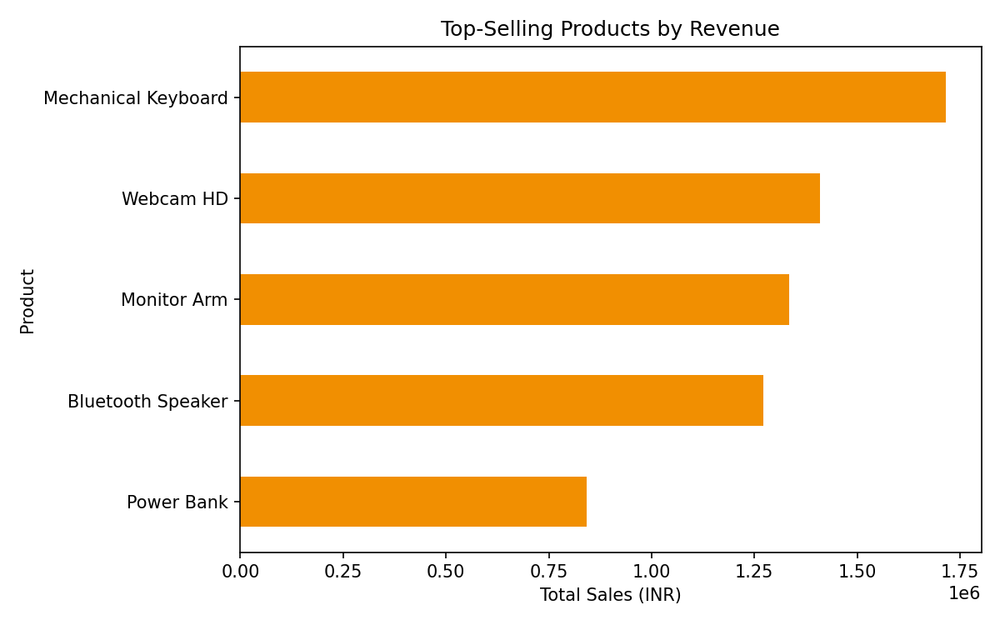
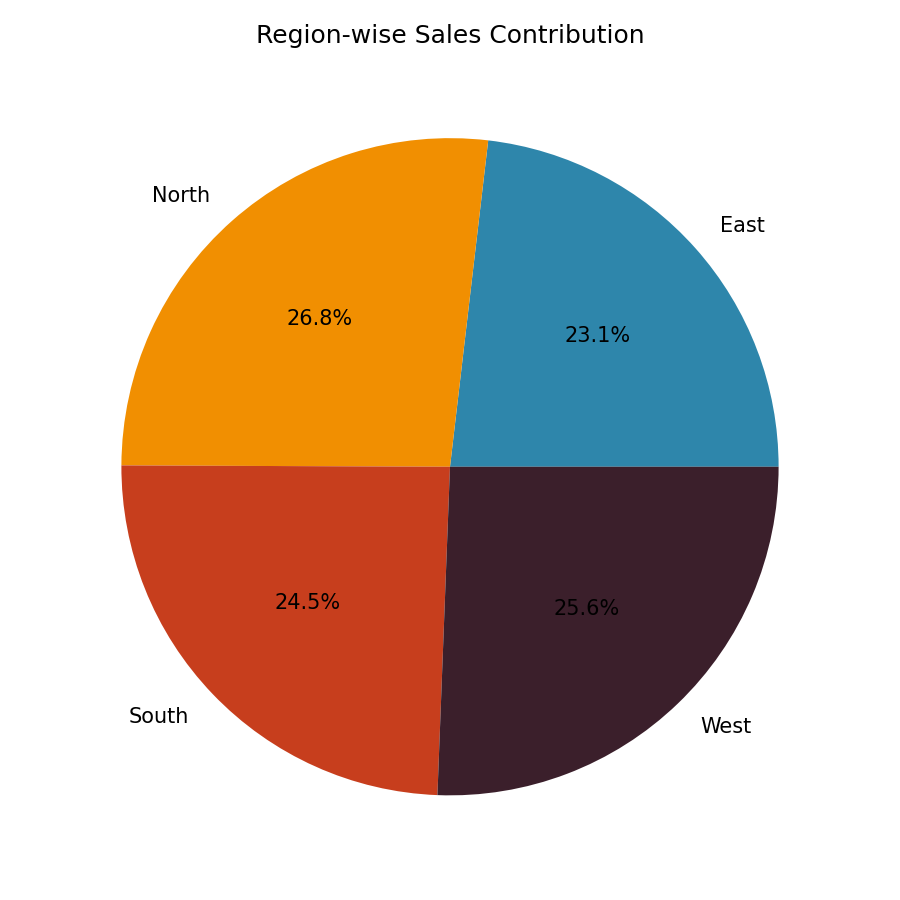

# Sales Data Analysis using Python

Internship project completed as part of the **Python Developer Internship** at **Codec Technologies**.

**Intern:** Pulkit Singh
**Role:** Python Developer Intern
**Duration:** 02 July 2026 – 02 September 2026

---

## 📌 Project Overview

This project performs exploratory data analysis (EDA) on a company's sales records to uncover:
- Monthly revenue trends
- Top-performing products
- Region-wise sales distribution

Built using **Python, Pandas, and Matplotlib**, the project follows a complete data analysis workflow — from raw data to actionable visual insights.

## 🛠️ Tools & Technologies

| Tool | Purpose |
|------|---------|
| Python 3 | Core programming language |
| Pandas | Data loading, cleaning & aggregation |
| Matplotlib | Chart generation & visualization |
| CSV | Raw dataset format |

## 🌐 Live Dashboard

An interactive version of this analysis is also available as a Streamlit dashboard — filter by region, product, and date range, and the charts update live.

**Live link:** _(add your Streamlit Cloud link here after deploying)_

Run it locally with:
```bash
pip install -r requirements.txt
streamlit run app.py
```

## 📂 Project Structure

```
├── generate_data.py           # Generates the synthetic sales dataset
├── sales_analysis.py          # Main analysis script (EDA + visualizations)
├── app.py                     # Interactive Streamlit dashboard
├── requirements.txt           # Dependencies for the dashboard
├── sales_data.csv             # Sales dataset (Jan–Jun 2026)
├── output_charts/             # Generated chart images
│   ├── monthly_trend.png
│   ├── top_products.png
│   └── region_sales.png
├── Internship_Project_Report.docx        # Full project report
├── Internship_Project_Presentation.pptx  # Project presentation slides
└── README.md
```

## ▶️ How to Run

```bash
pip install pandas matplotlib
python generate_data.py      # generates sales_data.csv
python sales_analysis.py     # runs analysis, prints summary, saves charts
```

## 📊 Key Results

- **Total Revenue Analyzed:** ₹84,07,198.12 across 837 transactions
- **Top Product:** Mechanical Keyboard (highest revenue generator)
- **Best Month:** March 2026
- **Region Split:** Fairly balanced across North, South, East, and West, with North leading at 26.8%

### Sample Visualizations

**Monthly Sales Trend**


**Top-Selling Products**


**Region-wise Distribution**


## 🎯 Key Learnings

- Practical experience with Pandas for data cleaning and aggregation
- Hands-on skills in Matplotlib for presentation-ready visualizations
- Improved ability to structure Python code into clean, reusable functions
- Exposure to a real-world style data analysis workflow

## 📄 Reports

- Full documentation: [`Internship_Project_Report.docx`](./Internship_Project_Report.docx)
- Presentation slides: [`Internship_Project_Presentation.pptx`](./Internship_Project_Presentation.pptx)

---

*This project was completed as part of the Python Developer Internship program at Codec Technologies.*
